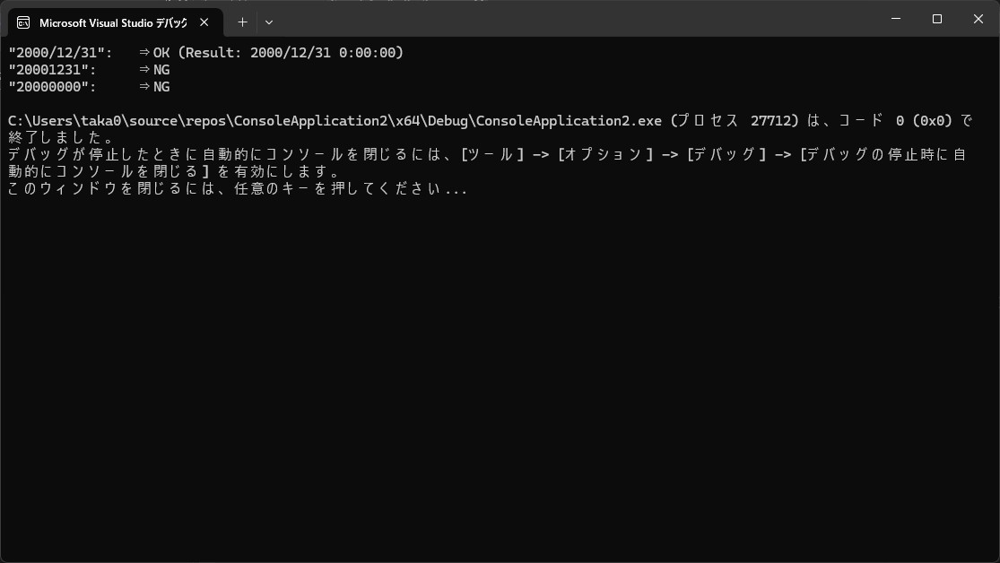

# ソースコード

```cpp
int main()
{
	array< System::String^>^ aryString = {
		"2000/12/31",
		"20001231",
		"20000000",
	};

	for each(System::String ^ s in aryString)
	{
		System::DateTime d;
		if (System::DateTime::TryParse(s, d))
		{
			System::Console::WriteLine("\"{0}\":\t⇒ OK (Result: {1})", s, d);
		}
		else
		{
			System::Console::WriteLine("\"{0}\":\t⇒ NG", s);
		}
	}
}
```


# 実行結果

